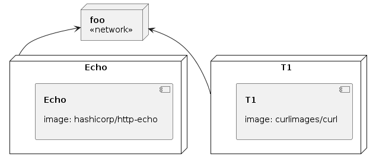

# exo: a process manager & log viewer for dev

**exo-** _prefix_ – external; from outside.


**Features**

- [Procfile](https://docs.deref.io/exo/manifests/migrate/procfiles) and [Docker Compose](https://docs.deref.io/exo/manifests/migrate/compose) compatible process manager.
- Terminal commands and browser-based-GUI for all functionality.
- Multiplexed, colorizing log tailing. Toggle visibility of individual logs.
- Dynamic process supervision: create, start, stop, restart, delete.

## Getting Started

Install Exo:

```bash
curl -sL https://exo.deref.io/install | bash
```

If you prefer package managers or manual installation, see
the [install docs](https://docs.deref.io/exo/getting-started/install) for
details, including uninstall instructions.

Navigate to your code directory and then launch the Exo gui:

```bash
exo gui
```

To use exo as a drop-in replacement for `foreman` or `docker-compose`, use
`run` instead:

```bash
exo run
```

This will work automatically with your `Procfile`, `compose.yaml`, or similarly
named manifest files. The `run` command also accepts an explicit filename, if
you have multiple configurations to choose from.

For more, checkout the [Exo documentation](https://docs.deref.io/exo/), watch some
[videos](https://docs.deref.io/exo/resources/videos) or consult the builtin help by running `exo help`.

---

## Support

Feel free to [open an issue](https://github.com/deref/exo/issues),
[tweet at us](https://twitter.com/intent/tweet?via=deref_inc),
[start a discussion](https://github.com/deref/exo/discussions),
or pop-in to our [#exo Slack channel](https://join.slack.com/t/deref-community/shared_invite/zt-tu8arun7-qqpVcTe3IDHjpSG_TrSaBQ).

## Telemetry

**exo** collects limited and anonymous telemetry data by default. This behavior
can be disabled by adding the following setting to your exo config (located at
`~/.exo/config.toml` by default):

```bash
[telemetry]
disable: true
```


### Infrastructure model

