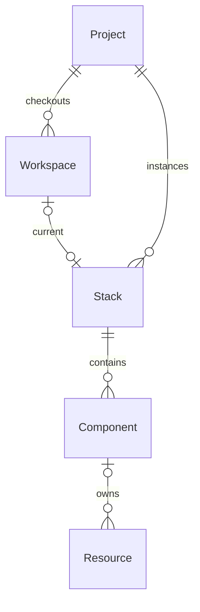

## Hierarchy

## Ownership

The hierarchy diagram shows the ideal, where resources are owned by components.
However, components may also be owned by stacks or projects. Additionally, they
may be ownerless - aka "orphans".

## Components vs Resources

Resources represent external entities manipulated by imperative operations. Exo
tracks resource records associated with Components, which abstractly represent
a set of desired resources and their states.

Each stack has a control loop which drives reconciliation of components and
resources. Reconciliation is a continous process that manipulates resources to
conform to the component specification.

Resources may not have a known identity (in the form of an IRI) until after
they are initialized. Until then, they have only a synthetic local ID. By
contrast, components are always addressible by stack + component-name. Once a
resource is identified with an IRI, that identity may not change. Components
can be renamed freely.

Resource state is represented by a "model", serializable to a data format
defined by the resource type. A resource controller provides conventional CRUD
operations in terms of these models.

Components have no state of their own. Instead, the state of a component is the
aggregate models of all the associated resources. The desired state is
described by a "spec" expression, which are evaluated during reconcilation to
render desired resource models.

Components may be disposed, which will schedule their owned resources to be
deleted. Disposed components are deleted only after all owned resources have
been deleted and associated tasks have terminated.
