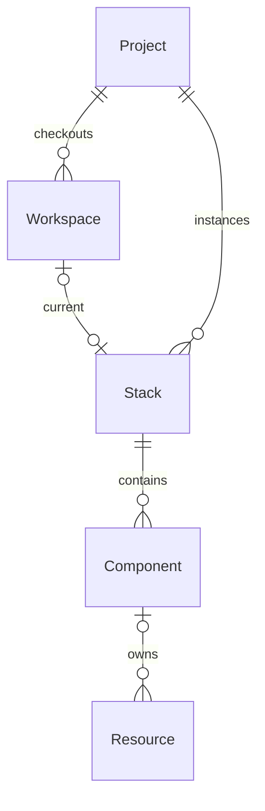

## Hierarchy

## Ownership

The hierarchy diagram shows the ideal, where resources are owned by components.
However, components may also be owned by stacks or projects. Additionally, they
may be ownerless - aka "orphans".
